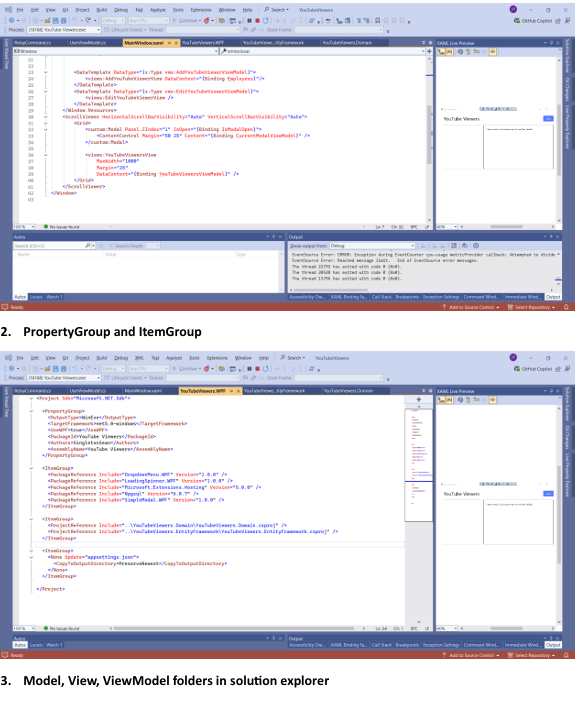
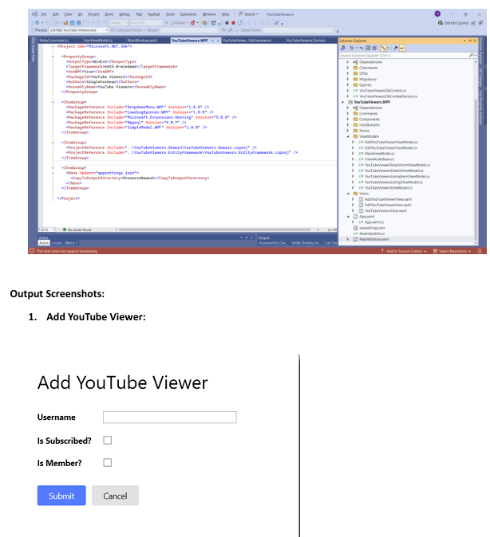
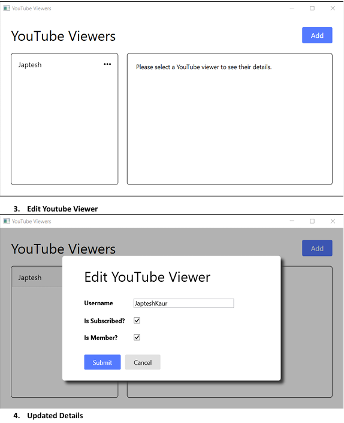

# YouTube Viewers WPF Application

## Project Summary
The **YouTube Viewers** application is a WPF (Windows Presentation Foundation) application developed using .NET 5. This application is designed to manage and display a list of YouTube viewers using CRUD operations. It incorporates the MVVM (Model-View-ViewModel) architecture to ensure a clean separation of concerns and maintainability.

## Project Name
**YouTube Viewers**

## Code
To refer to the code of the project, please find the attached zipped document in the email.

## Description
The YouTube Viewers application provides functionality for adding, editing, viewing, and managing YouTube viewers' details. With an intuitive interface and modal dialogs, the application offers a smooth user experience. Custom styles enhance the visual appeal, making the application user-friendly and professional.

## Key Features
- **Add YouTube Viewer**: Users can add new YouTube viewers by entering their details and clicking the submit button.
- **Edit YouTube Viewer**: Users can modify the details of existing YouTube viewers.
- **View YouTube Viewers**: A list of YouTube viewers is displayed, allowing users to view their details.
- **Modal Dialogs**: Utilizes modal dialogs for adding and editing viewers to provide a seamless experience.
- **Custom Styles**: Includes custom styles for buttons and other UI elements to enhance the overall visual design.

## Technologies Used
- **.NET 5**: Ensures compatibility with the latest features and improvements.
- **WPF**: Used for building a rich and responsive user interface.
- **MVVM Pattern**: Separates the UI from business logic for better maintainability and testing.
- **Third-Party Libraries**:
  - `DropdownMenu.WPF`
  - `LoadingSpinner.WPF`
  - `SimpleModal.WPF`

## Code Snippets
1. **XAML File using Grid View**
2. **PropertyGroup and ItemGroup**
3. **Solution Explorer Structure**:
   - `Model`
   - `View`
   - `ViewModel`

## Output Screenshots

   

   

   

   

